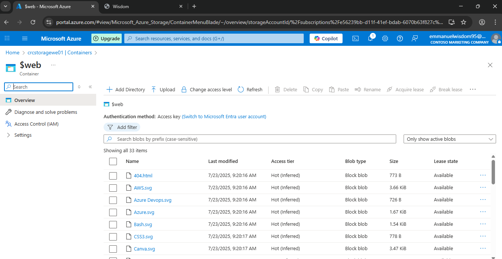
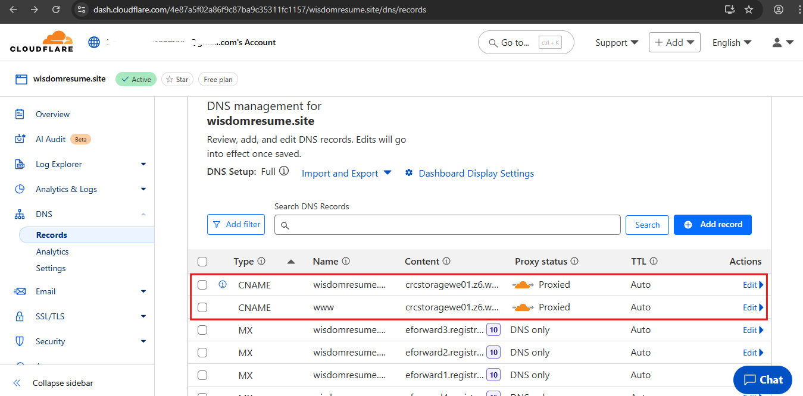
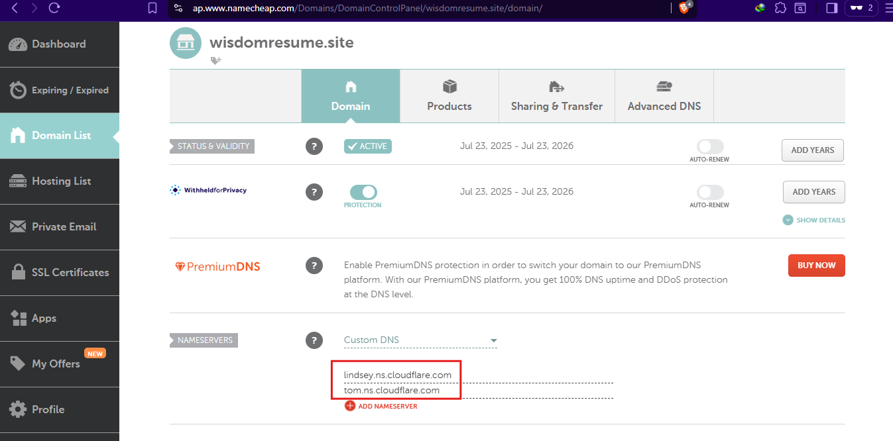

# 🚀 Cloud Resume Challenge (Azure Edition)

This project is part of the Cloud Resume Challenge inspired by [Forrest Brazeal](https://cloudresumechallenge.dev/). It showcases my practical cloud skills using **Microsoft Azure** and includes:
- A responsive HTML/CSS resume website
- Static hosting via **Azure Blob Storage**
- Version control and CI/CD using **GitHub Actions**
- Future integration of **Azure Functions**, **Cosmos DB**, and **Infrastructure as Code**

---

## 📌 Project Progress

| Stage | Description | Status | Notes |
|-------|-------------|--------|-------|
| 1 | **Azure Fundamentals Certification (AZ-900)** | ✅ Done | Passed and certified |
| 2 | **HTML Resume Created** | ✅ Done | `index.html` completed |
| 3 | **CSS Styling Applied** | ✅ Done | External `styles.css` used |
| 4 | **Website Hosted on Azure Blob Storage** | ✅ Done | Static site deployed: [Live Site](https://crcstoragewe01.z6.web.core.windows.net//) |
| 5 | **HTTPS for Azure Storage URL using Azure CDN** | ✅ Done | Azure CDN profile created |
| 6 | **DNS Domain for Azure CDN endpoint** | ✅ Done | Custom domain added to Azure CDN endpoint |
| 7 | **Frontend JS for Visitor Counter** | 🔜 Pending | Integrate API with resume site |
| 8 | **Azure Cosmos DB / Table Storage** | 🔜 Pending | Store and retrieve visitor count data |
| 9 | **Azure Function Backend API (Visitor Counter)** | 🔜 Pending | Will handle API requests |
|10 | **Python Azure Function (Backend Logic)** | 🔜 Pending | Python code to handle serverless logic |
|11 | **Python Code Testing** | 🔜 Pending | Unit tests to ensure Azure Function logic is reliable and bug-free |
|12 | **Infrastructure as Code (Bicep/Terraform)** | 🔜 Optional | Automate resource provisioning |
|13 | **Source Control & CI/CD** | 🔜 Pending | GitHub repo and workflows to auto-deploy frontend and backend on code changes |
|14 | **CI/CD Pipeline for Backend** | 🔜 Pending | GitHub Actions to run tests and deploy Azure Function and IaC templates automatically |
|15 | **CI/CD Pipeline for Frontend** | 🔜 Pending | Automate frontend deployment to Azure Blob Storage via GitHub Actions, with optional CDN cache purge |
|16 | **Blog Post Summary** | 🔜 Pending | Will write and publish a short blog post reflecting on lessons learned during the Cloud Resume Challenge |

----------

# 🌩️ Cloud Resume Challenge (Azure Edition)

This is my implementation of the [Cloud Resume Challenge](https://cloudresumechallenge.dev/docs/the-challenge/azure/) by Forest Brazeal — an end-to-end full-stack cloud project designed to demonstrate real-world cloud engineering skills.

## 🔗 Current Live Project
**[🌐 View the Live Site](https://wisdomresume.site/)** 

---

## 📸 Final Deployed Website

**Live Website** In progress..

---

As I take on the Cloud Resume Challenge, I’ve been able to earn the Microsoft AZ-900 certification and I also have some background in frontend web design. I’ve built the first version of my resume website using HTML and CSS, and from here, I’ll be documenting the next steps I’m working through as I continue learning and building.

## 📁 1. Static Website Hosting (Azure Blob Storage)

Used Azure Blob Storage to host a static website with an `index.html` and `styles.css`.

- Enabled static website hosting on Azure Storage Account
- Uploaded files into the `$web` container

📸 Screenshot:

Azure static website hosting:

---

## 🔐 2. HTTPS, and Custom Domain (via Cloudflare)

I opted to use Cloudflare’s CDN instead of Azure CDN because Azure CDN requires a Pay-As-You-Go subscription, which isn't supported under the Free Trial plan I'm currently using for this project. Cloudflare, on the other hand, offers a free CDN service, along with free SSL certificates for custom domains, allowing me to serve my static website securely over HTTPS at no additional cost.

Domain was purchased via Namecheap and pointed to Azure via **Cloudflare**:

- Custom domain `wisdomresume.site`
- Free SSL with Cloudflare Universal Certificate
- DNS settings managed on Cloudflare

📸 Screenshot:

Cloudflare DNS Settings:

Namecheap Custom Nameservers:

### 🔎 A Few Things I Noticed (If You're Using a Third-Party CDN Like Cloudflare for HTTPS on Azure Static Sites)

If you want your static website to run smoothly over HTTPS without any issues, here are a few key things to keep in mind:

- ✅ **Ensure "Secure transfer required" is enabled** in your Azure Storage Account settings.  
  This enforces HTTPS connections to your static site endpoint.

- 🔐 In your **Cloudflare SSL/TLS settings**, set the encryption mode to **Full (Strict)**.  
  This ensures Cloudflare connects to Azure over HTTPS — which is important because with “secure transfer required” enabled, Azure will reject any HTTP requests. Without this, you may run into the error:

`The account being accessed does not support http.`
`HttpStatusCode: 400`
`ErrorCode: AccountRequiresHttps`

- ☁️ In your **Cloudflare DNS records**, make sure any CNAME or A record pointing to your Azure endpoint is set to **Proxied** (orange cloud).  
This allows Cloudflare to properly handle HTTPS and redirects on your behalf.

---

---

## 📚 License

This project is licensed under the [MIT License](LICENSE).

